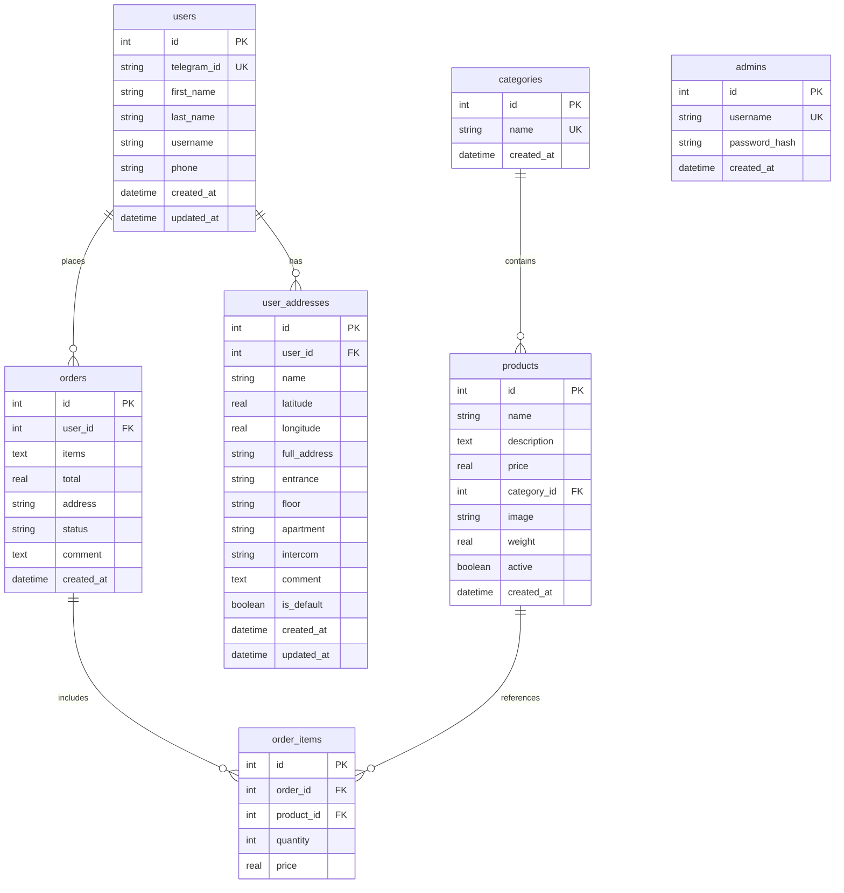

# 🗄️ База данных DeliveryVLG

## Обзор

DeliveryVLG использует SQLite база данных для хранения всех данных приложения. SQLite выбрана за простоту развертывания, надежность и достаточную производительность для приложения доставки.

## 📊 Схема базы данных

### Основные таблицы



## 🚀 Быстрое развертывание

### Метод 1: Автоматическое создание

База данных создается автоматически при первом запуске приложения:

```bash
# Установите зависимости
npm install

# Скопируйте настройки
cp env.example .env
nano .env  # Настройте ADMIN_USERNAME и ADMIN_PASSWORD

# Запустите приложение
npm start
```

База данных `delivery.db` будет создана автоматически.

### Метод 2: Ручное создание

```bash
# Убедитесь что SQLite установлен
sudo apt install sqlite3  # Ubuntu/Debian
# или
brew install sqlite3      # macOS

# Создайте базу данных
sqlite3 delivery.db < database/schema.sql

# Проверьте создание
sqlite3 delivery.db ".tables"
```

## 📋 Детальное описание таблиц

### 1. `users` - Пользователи Telegram

Хранит информацию о пользователях Telegram Mini App.

```sql
CREATE TABLE users (
    id INTEGER PRIMARY KEY AUTOINCREMENT,
    telegram_id TEXT UNIQUE NOT NULL,    -- ID пользователя в Telegram
    first_name TEXT,                     -- Имя
    last_name TEXT,                      -- Фамилия
    username TEXT,                       -- Username в Telegram
    phone TEXT,                          -- Номер телефона
    created_at DATETIME DEFAULT CURRENT_TIMESTAMP,
    updated_at DATETIME DEFAULT CURRENT_TIMESTAMP
);
```

**Индексы:**
- `idx_users_telegram_id` - быстрый поиск по Telegram ID
- `idx_users_username` - поиск по username

### 2. `categories` - Категории товаров

```sql
CREATE TABLE categories (
    id INTEGER PRIMARY KEY AUTOINCREMENT,
    name TEXT UNIQUE NOT NULL,           -- Название категории
    created_at DATETIME DEFAULT CURRENT_TIMESTAMP
);
```

**Предустановленные категории:**
- Мороженное (id: 1)
- Пельмени (id: 2)

### 3. `products` - Товары

```sql
CREATE TABLE products (
    id INTEGER PRIMARY KEY AUTOINCREMENT,
    name TEXT NOT NULL,                  -- Название товара
    description TEXT,                    -- Описание
    price REAL NOT NULL,                 -- Цена в рублях
    category_id INTEGER,                 -- Связь с категорией
    image TEXT,                          -- Путь к изображению
    weight REAL,                         -- Вес в граммах (может быть NULL)
    active BOOLEAN DEFAULT 1,            -- 1 = активен, 0 = скрыт
    created_at DATETIME DEFAULT CURRENT_TIMESTAMP,
    FOREIGN KEY (category_id) REFERENCES categories (id)
);
```

**Индексы:**
- `idx_products_category` - группировка по категориям
- `idx_products_active` - фильтрация активных товаров

### 4. `orders` - Заказы

```sql
CREATE TABLE orders (
    id INTEGER PRIMARY KEY AUTOINCREMENT,
    user_id INTEGER NOT NULL,            -- Связь с пользователем
    items TEXT,                          -- JSON с товарами (совместимость)
    total REAL NOT NULL,                 -- Общая сумма заказа
    address TEXT,                        -- Адрес доставки
    status TEXT DEFAULT 'pending',       -- Статус заказа
    comment TEXT,                        -- Комментарий к заказу
    created_at DATETIME DEFAULT CURRENT_TIMESTAMP,
    FOREIGN KEY (user_id) REFERENCES users (id)
);
```

**Статусы заказов:**
- `pending` - Ожидает подтверждения
- `confirmed` - Подтвержден
- `preparing` - Готовится
- `delivering` - Доставляется
- `delivered` - Доставлен
- `cancelled` - Отменен

**Индексы:**
- `idx_orders_user_id` - заказы пользователя
- `idx_orders_status` - фильтрация по статусу
- `idx_orders_created_at` - сортировка по дате

### 5. `order_items` - Товары в заказе

Нормализованная таблица для детального учета товаров в заказе.

```sql
CREATE TABLE order_items (
    id INTEGER PRIMARY KEY AUTOINCREMENT,
    order_id INTEGER NOT NULL,           -- Связь с заказом
    product_id INTEGER NOT NULL,         -- Связь с товаром
    quantity INTEGER NOT NULL,           -- Количество
    price REAL NOT NULL,                 -- Цена на момент заказа
    FOREIGN KEY (order_id) REFERENCES orders (id),
    FOREIGN KEY (product_id) REFERENCES products (id)
);
```

### 6. `user_addresses` - Адреса пользователей

```sql
CREATE TABLE user_addresses (
    id INTEGER PRIMARY KEY AUTOINCREMENT,
    user_id INTEGER NOT NULL,            -- Связь с пользователем
    name TEXT NOT NULL,                  -- Название адреса
    latitude REAL,                       -- Широта
    longitude REAL,                      -- Долгота
    full_address TEXT,                   -- Полный адрес
    entrance TEXT,                       -- Подъезд
    floor TEXT,                          -- Этаж
    apartment TEXT,                      -- Квартира
    intercom TEXT,                       -- Код домофона
    comment TEXT,                        -- Комментарий
    is_default BOOLEAN DEFAULT 0,        -- Основной адрес
    created_at DATETIME DEFAULT CURRENT_TIMESTAMP,
    updated_at DATETIME DEFAULT CURRENT_TIMESTAMP,
    FOREIGN KEY (user_id) REFERENCES users (id) ON DELETE CASCADE
);
```

### 7. `admins` - Администраторы

```sql
CREATE TABLE admins (
    id INTEGER PRIMARY KEY AUTOINCREMENT,
    username TEXT UNIQUE NOT NULL,       -- Логин администратора
    password_hash TEXT NOT NULL,         -- Хеш пароля (bcrypt)
    created_at DATETIME DEFAULT CURRENT_TIMESTAMP
);
```

## 🔧 Управление данными

### Создание администратора

Администратор создается автоматически при первом запуске на основе переменных окружения:

```env
ADMIN_USERNAME=admin
ADMIN_PASSWORD=your_secure_password
```

### Добавление продуктов

```sql
-- Добавить новую категорию
INSERT INTO categories (name) VALUES ('Напитки');

-- Добавить продукт
INSERT INTO products (name, description, price, category_id, image, weight, active) 
VALUES ('Coca-Cola', 'Прохладительный напиток', 50.0, 3, '/uploads/coca-cola.jpg', 330, 1);
```

### Управление заказами

```sql
-- Обновить статус заказа
UPDATE orders SET status = 'confirmed' WHERE id = 1;

-- Получить заказы пользователя
SELECT o.*, u.first_name, u.last_name 
FROM orders o 
JOIN users u ON o.user_id = u.id 
WHERE u.telegram_id = '1717714804';
```

## 📈 Оптимизация производительности

### Настроенные индексы

Все критические индексы уже созданы в схеме:

```sql
-- Пользователи
CREATE INDEX idx_users_telegram_id ON users(telegram_id);
CREATE INDEX idx_users_username ON users(username);

-- Продукты
CREATE INDEX idx_products_category ON products(category_id);
CREATE INDEX idx_products_active ON products(active);

-- Заказы
CREATE INDEX idx_orders_user_id ON orders(user_id);
CREATE INDEX idx_orders_status ON orders(status);
CREATE INDEX idx_orders_created_at ON orders(created_at);

-- Товары в заказе
CREATE INDEX idx_order_items_order_id ON order_items(order_id);
CREATE INDEX idx_order_items_product_id ON order_items(product_id);

-- Адреса
CREATE INDEX idx_user_addresses_user_id ON user_addresses(user_id);
CREATE INDEX idx_user_addresses_default ON user_addresses(is_default);
```

### Настройки SQLite

Для оптимальной производительности рекомендуется:

```sql
-- Включить WAL режим для лучшей concurrent производительности
PRAGMA journal_mode = WAL;

-- Увеличить cache size
PRAGMA cache_size = 10000;

-- Включить foreign keys
PRAGMA foreign_keys = ON;
```

## 🔒 Безопасность данных

### Хеширование паролей

Пароли администраторов хешируются с использованием bcrypt:

```javascript
const bcrypt = require('bcrypt');
const passwordHash = await bcrypt.hash(password, 10);
```

### Валидация данных

- Все внешние ключи имеют ограничения FOREIGN KEY
- Обязательные поля отмечены как NOT NULL
- Уникальные поля защищены UNIQUE ограничениями

### Резервное копирование

```bash
# Создать резервную копию
cp delivery.db backup_$(date +%Y%m%d_%H%M%S).db

# Или экспорт в SQL
sqlite3 delivery.db .dump > backup.sql

# Восстановление из SQL
sqlite3 new_delivery.db < backup.sql
```

## 🛠️ Миграции

При изменении схемы используйте SQL миграции:

```sql
-- Добавить новый столбец
ALTER TABLE products ADD COLUMN discount REAL DEFAULT 0;

-- Обновить индексы
CREATE INDEX idx_products_discount ON products(discount);
```

## 📊 Мониторинг

### Полезные запросы для мониторинга

```sql
-- Статистика заказов
SELECT status, COUNT(*) as count 
FROM orders 
GROUP BY status;

-- Популярные товары
SELECT p.name, SUM(oi.quantity) as total_sold
FROM products p 
JOIN order_items oi ON p.id = oi.product_id
GROUP BY p.id, p.name 
ORDER BY total_sold DESC;

-- Активность пользователей
SELECT COUNT(*) as total_users FROM users;
SELECT COUNT(*) as total_orders FROM orders;
SELECT AVG(total) as avg_order_value FROM orders;
```

## 🚨 Устранение неполадок

### Распространенные проблемы

1. **База данных заблокирована**
   ```bash
   # Проверить процессы
   lsof delivery.db
   
   # Переключиться в WAL режим
   sqlite3 delivery.db "PRAGMA journal_mode=WAL;"
   ```

2. **Повреждение базы данных**
   ```bash
   # Проверить целостность
   sqlite3 delivery.db "PRAGMA integrity_check;"
   
   # Восстановить из резервной копии
   cp backup_latest.db delivery.db
   ```

3. **Медленные запросы**
   ```sql
   -- Анализ запросов
   EXPLAIN QUERY PLAN SELECT * FROM orders WHERE user_id = 1;
   
   -- Обновить статистику
   ANALYZE;
   ```

---

**💡 Совет:** Регулярно создавайте резервные копии и мониторьте размер базы данных для обеспечения оптимальной производительности. 